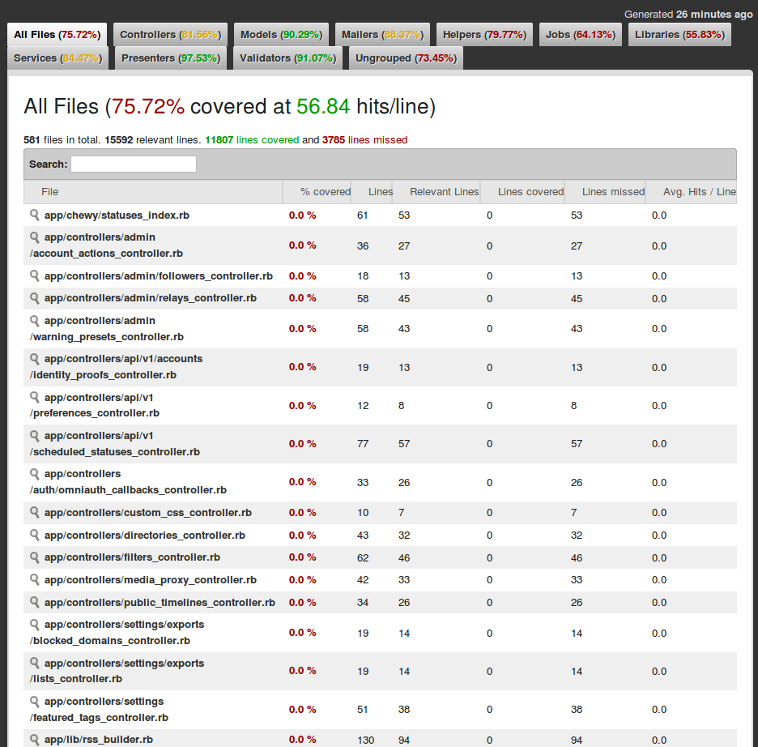
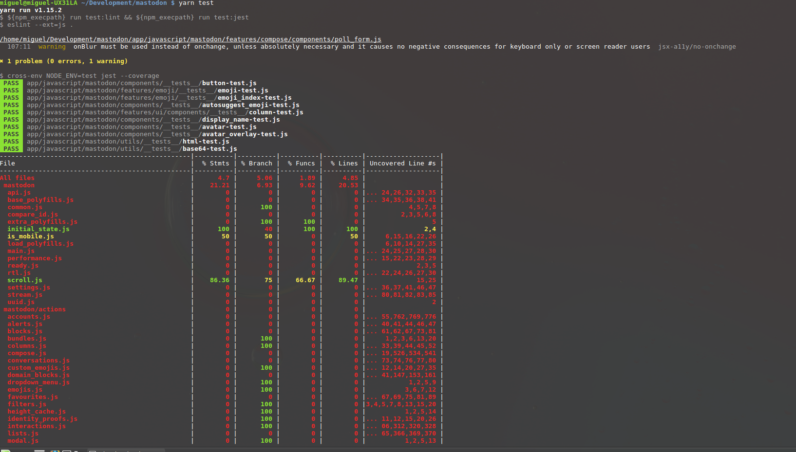
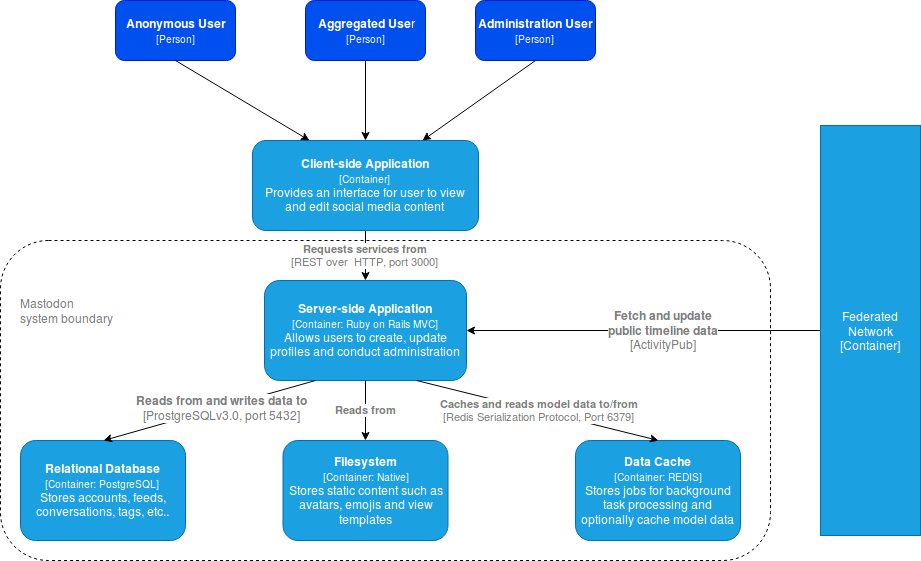
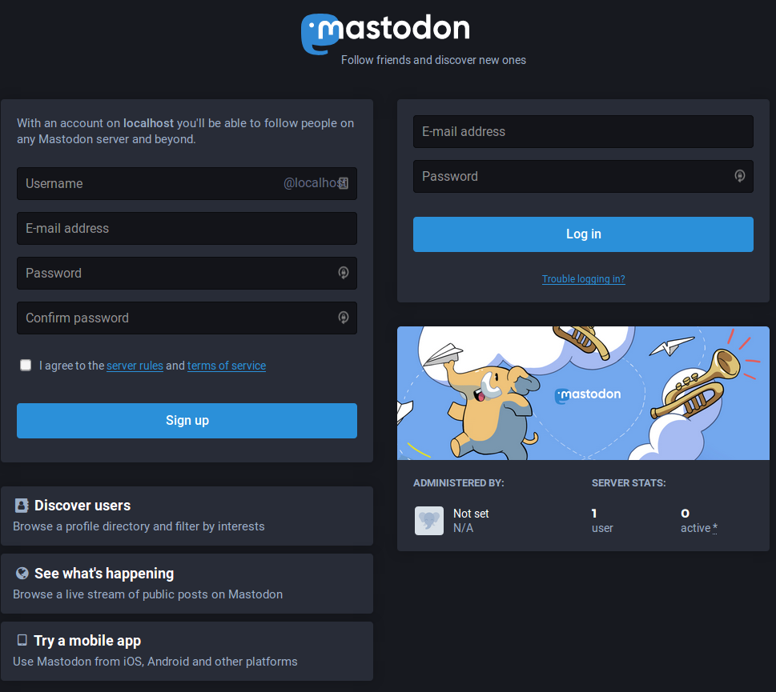

# Case Study - Mastodon

## Project Description

Mastodon is a decentralized social media platform which supports self-hosted and independent instances through federation. Federation is achieved through the AcitivityPub protocol which using mailbox system for sending and recieving messages accross different servers supporting the protocol.

## Installation

TODO: add installation steps here 

From the official page, installation assumes Ubuntu 18.04 but I have Ubuntu version 16.04 on my local machine.

## Technology Stack
- __Ruby__: language used to implement the majority of backend functionality
- __Rails__: web application framework supporting MVC design pattern
- __React.js__: front end for managing UI elements
- __PostgresSQL__: relational database acting as the persistent store for the models used in mastodon.
- __Redis__: Redis is an in-memory data store applicable for several use cases. Mastodon primarily uses Redis as a 
cache which is accessed through the Rails controllers. 
- __Node.js__: Used to handle streaming media to clients.
- __yarn__: Alternative javascript package manager. I am not entirely sure why `npm` is not solely used in the project
but from `yarn`'s description, it aims to avoid the headaches of getting packages to install across different machines
and configurations.

## Programming Language Usage 
Mastodon's codebase in split into two main languages javascript and Ruby. Javascript code can be found in `app/javascript`.
Ruby code can be found in the directories located in the `app` parent directory. 

### Ruby
Naturally used in the backend where they implement logic needed to complete tasks such as fetch data from the 
postgres database and render web pages for the frontend. Web pages are created using __Rails__ web application 
framework. Ruby code within the project follow typical Object Oriented (OO) style where all class properties or member
variables are private and can only accessed through getters and setters. 

#### Ruby Libraries

The backend relies on roughly 303 `gems`. This was calculated on the tip of the master branch. For brevity, this report will
only list a few notable libraries that are used throughout the project.

- __websocket__: library providing an API to support bidirectional communication between `javascript` and `ruby` backend through
the familar socket function calls such as `open()`, `send()` and `read()`. In mastodon, websockets are mainly used to implement
the streaming functionaility that provides live updates about toots. 
- __webpacker__: provides a means to manage dependencies between javascript modules within Rails appllications
- __sidekiq__: a job scheduler library for managing jobs in Ruby. During the lifecycle of the application, mastodon will create
`Sidekiq::Worker`s to handle baackground tasks such as updating feeds and displaying notifications
- __Rails__: 
  - __Model__: In keeping with the __DRY__ principle each tables defined in the postgres sql database instance have their 
equivalent ruby class file in `app/models`. Models are implemented as Active Records which are defined in the Object/Relational Mapping (ORM) layer. 
This allows for a seamless mapping of tables to Ruby objects. 
  - __View__: For templating, HTML abstraction markup language (`haml`) is used instead of the standard Embedded Ruby (ERB)
templating. From looking at the process of converting ERB to Haml, it appears that Haml prefers a much less verbose
syntax that you will typically find in many templating frameworks. ERB implements a similar templating strategy that you
will find in many older languages (java, php, etc.). Once looking at `haml`, one immediate characteristic is the influence
of CSS like syntax.
  - __Controller__: Controllers are a type of `ApplicationController` which handle routing, updating models, managing sessions, etc.

### Javascript
Only counts for a small percentage of the source code base (26%). Javascript in mastodon is utilized to implement
views of the various models defined in the application. User actions, such as clicking on a user profile, will invoke javascript
generated `http` GET requests to corresponding RESTFUL endpoints. Likewise, post requests will invoke `http` post request whyich may
update models stored within the database. Responses are typically in the form a json dictionary containing requested information. 
DOM updates are primarily routed to the React.js library rather interacting with the DOM directly.

#### Javascript Libraries

- __redux__: a library providing a maintainable approach to stateful user interface design. Redux closely follows the `Flux` design
pattern which helps developers reason about complex state mutations as a result of various factors within non-trivial applications.
A `Flux` application consists of four components: (1) actions (2) dispatcher (3) stores and (4) controller-views. 
  - __actions__: an object describing units of updates which should be applied to a store
  - __dispatcher__: distributes created actions to stores which register callback functions with the dispatcher
  - __store__: represents the state of a component. State is not manipulated directly but rather through actions. This inversion of control nicely
  enforces SoC (Separation of Concerns) and promotes more maintainable code
  - __controller-view__: the stores pass the newly computed state objects to their respective or interested views so that thier own state can
  be updated accordignly.
  
  redux deviates slightly from Flux in a few ways. Firstly, there is only one store which maintains a single object describing the state of the 
entire application. There are no dispatchers to update the store but rather __reducers__ which are pure functions that compute state changes based
on the actions. Overall redux fits nicely with user interface frameworks such as React which maintain a stateful view of the Document Object Mode (DOM).
- __react__: a popular user interface library which simplifies state management of view related concepts. The power of react starts with the virtual DOM.
Applications which use react will indirectly manipulate the DOM by first applying changes to an in-memory copy. This modified copy is compared with the original
DOM and changes are reconcilidated by only updating nodes within the DOM that were changed. 

### Thoughts on Programming Languages

Using Ruby on Rails as the backend language is a understandable choice given its large community folowwing and straightfoward syntax.
Despite my unfamilarity with the Ruby, I can predict that picking up the language will not be too much of a challenge because it is influenced 
by the more popular languages perl and python. In contrast, the use of javascript requires little justification; it is the standard scripting
language frontend applications. 

If I were to implemented an application in the similar vein to mastodon, I would not depature too much from their choices. My changes would mainly
be driven by biases due to familiarity. Therefore, if given the choice I would rather implement the backend using python. My experience with python
has led me to prefer its syntax and how object oriented concepts are implemented. However there are some considerations I would make be commiting
to this idea. First, there would need to be an understanding of implications on performance (e.g. will cPython be adequate or will another implementation be needed?).
Second, how will mastodon python backend scale as more local users create accounts and more federated mastodon server instances are created? Lastly, we have to 
consider if the available web frameworks for python are sufficient enough for mastodon. I believe Django is equivelent to Rails in terms of supporting the 
Model View Controller paradigm. It also has the option of Django webpacker for managing frontend files.

## Build System

Since mastodon is a web application built on languages which are compiled JIT (Just in Time), there is no concept of building. 
Instead mastodon requires several services or processes to run before it can serve clients. As a user who is not interested in 
underlying details, you can use `foreman` gem to spawn the needed process dependencies. In the project, two files `Procfile` and `Procfile.dev` indicate
which processes need to run and their corresponding arguments. The `.dev` denotes launch configuration for development enviornments. From a quick glance
at the production `Procfile`, mastodon spawns a [puma](https://github.com/puma/puma) web server that houses the rails application. Additionally
a background process, `sidekiq` is started to handle asynchronous job requests from the main Rails app.

## Testing

Mastodon project utilizes two automated testing methods for coverage of both Ruby and javascript source code.

#### Ruby testing
Ruby testing is automated through
[rspec](rspec.info),  a testing framework applications developed in the Ruby programming language. The philosophy of
this framework is __Test Driver Development__ or (__TDD__). Canonical TDD emphasizes that tests be developed in parallel
with implementations. However, for many developers this is challenge because the additional overhead of maintaining both
application logic and testing logic can be burdensome. With TDD, the idea is to develop tests beforehand and let
__failing__ tests drive implementation. Despite this awkward indirection, following this paradigm can better garuntee
much higher testing code coverage than the conventional ad-hoc write-tests-after-implementation.

A nice feature of rspec is that it also provides a nice interface to view what percentage of your code tests cover.
rspec generates static web page with a single `.html` after running the ruby test suite defined in the `mastodon`
project directory. The figure below shows an example output after running the test suite.

From closer inspection, its seems that defined tests have a healthy balance of coverage among the various modules/paths.
The two outliers are `jobs` and `libraries`. Some classes within these paths are deemed obsolete which can be one
explanation for lower code coverage.

#### javascript testing
javascript testing is automated through the use of `yarn` and `npm`. When executing `yarn run test` or `yarn test` in
the root project directory, `yarn` will ask `npm` to run a linter (`eslint`) for convention conformance checking and
more importantly run automated testing using [jest](https://jestjs.io/). Jest is a natural fit for mastadon because
they primarily use __React__ to manage the frontend on the client side. Like `rspec`, code coverage report is generated
if the `--coverage` flag is passed to `jest`. The figure below shows a snippet of testing mastodon javascript codebase
using `jest`.

Although not as convenient as `rspec`, html generated output, it does give a good idea what parts of code are touched the
most by the test cases with a quick glance.

#### Continuous Integration
Mastodon uses [circleci](https://circleci.com/) as their continuous integration platform. CircleCI is a cloud based continuous integration platform much like travisCI which provides a RESTFUL API for easy integration with user defined applications. Users configure jobs to run upon integration within the `.circleci/config.yml`. An interesting feature of CircleCI is ability to run jobs sequentially or fan out at defined points to quickly identify problematic builds. In terms of platforms, circleCI supports supports spinning up Android, GNU/Linux and macOS platforms for testing and deployment. Mastodon `circleci/config.yml` specifes the use of `circleci/ryby:2.6.0-stretch node` for the `docker` configuration. This image corresponds to the `Debian stretch` operatinng system. 

## Architecture

Mastodon's architecture is similar to that of a conventional web application; it features a responsive frontend using Facebook's `React.js` library and a backend component which handles retrieving and updating models along with providing the correct views to the user depending on the RESTFUL endpoint. The figure below shows the container view of the system.

## Issues

TODO: Add issues here

## Demo

TODO: add demonstation images and description

