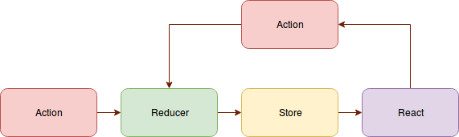
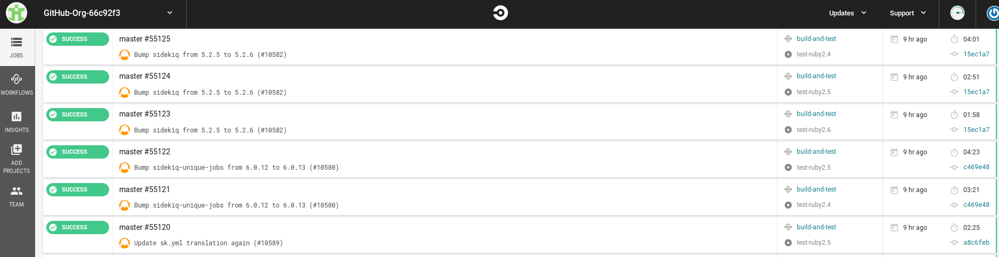
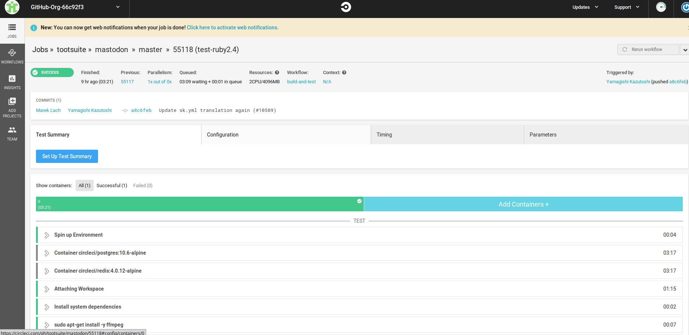
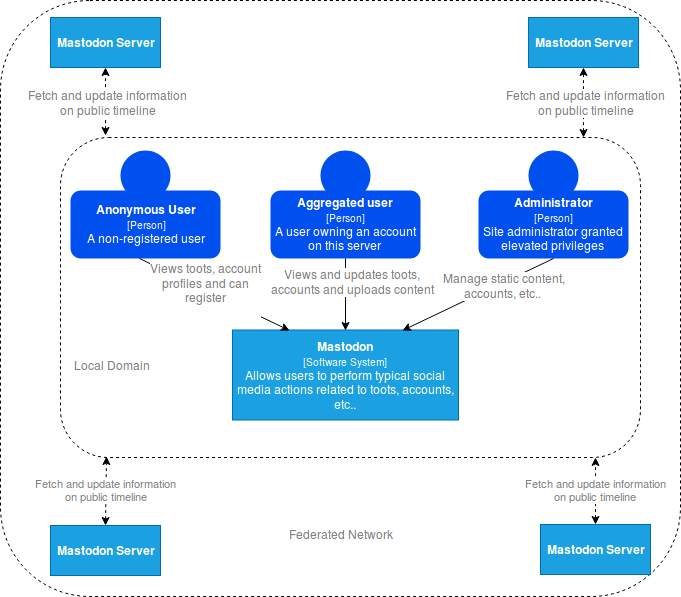
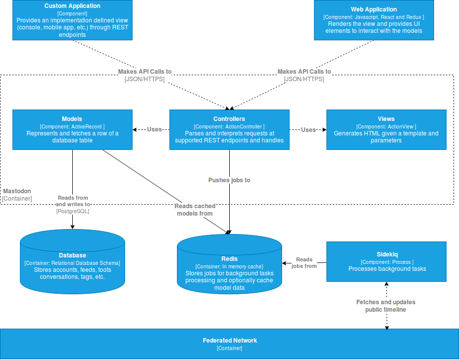
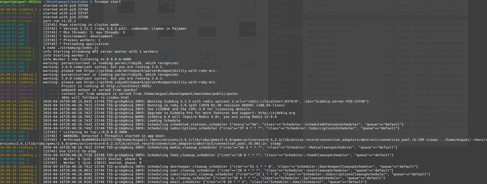
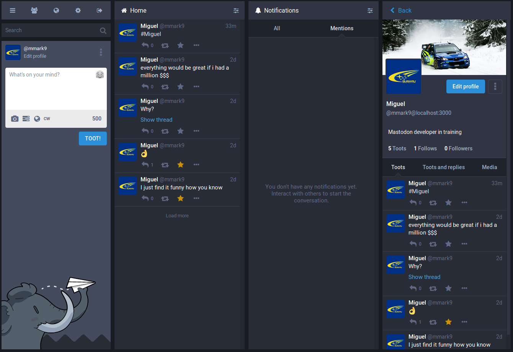
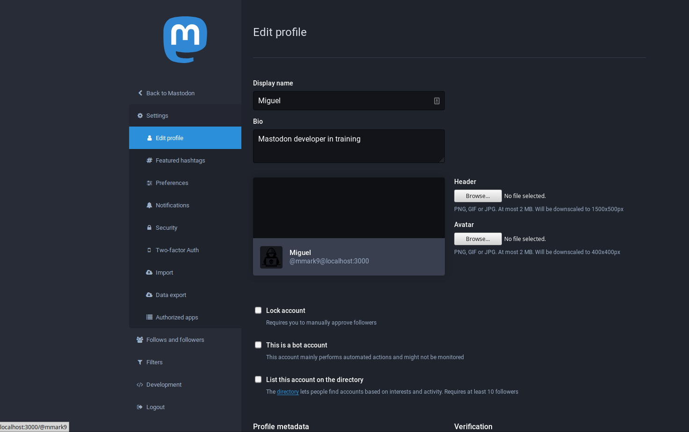

# Case Study - Mastodon

## Project Description

Mastodon is a decentralized social media platform which supports self-hosted and independent instances through federation. Federation is achieved through the [AcitivityPub protocol](https://www.w3.org/TR/activitypub/) which using a mailbox system for sending and receiving messages across different servers supporting the protocol.

## Technology Stack
- __Ruby__: language used to implement the majority of backend functionality
- __Rails__: web application framework supporting MVC design pattern
- __React.js__: front end for managing UI elements
- __PostgresSQL__: relational database acting as the persistent store for the models used in Mastodon.
- __Redis__: Redis is an in-memory data store applicable for several use cases. Mastodon primarily uses Redis as a 
cache which is accessed through the Rails controllers. 
- __Node.js__: Used to handle streaming media to clients.
- __yarn__: Alternative javascript package manager. I am not entirely sure why `npm` is not solely used in the project
but from `yarn`'s description, it aims to avoid the headaches of getting packages to install across different machines
and configurations.


## Programming Language Usage 
Mastodon's codebase in split into two main languages javascript and Ruby. Javascript code can be found in `app/javascript`.
Ruby code can be found in the directories located in the `app` parent directory. 

### Ruby
Naturally used in the backend where they implement logic needed to complete tasks such as fetch data from the 
postgresql database and render web pages for the frontend. Web pages are created using __Rails__ web application framework. Ruby code within the project follows a typical Object Oriented (OO) style where all class properties or member
variables are private and can only be accessed through getters and setters. 

#### Ruby Libraries

The backend relies on roughly 303 `gems`. This was calculated on the tip of the master branch. For brevity, this report will
only list a few notable libraries that are used throughout the project.

- __websocket__: library providing an API to support bidirectional communication between `javascript` and `ruby` backend through
the familiar socket function calls such as `open()`, `send()` and `read()`. In mastodon, WebSockets are mainly used to implement
the streaming functionality that provides live updates about toots. 
- __doorkeeper__: OAuth2 provider
- __paper__: paperclip: provides file upload and attachment functionality
- __webpacker__: provides a means to manage dependencies between javascript modules within Rails applications
- __sidekiq__: a job scheduler library for managing jobs in Ruby. During the lifecycle of the application, Mastodon will create
`Sidekiq::Worker`s to handle background tasks such as updating feeds and displaying notifications
- __Rails__: 
  - __Model__: In keeping with the __DRY__ principle each table defined in the PostgreSQL database instance have their equivalent ruby class file in `app/models`. Models are implemented as Active Records which are defined in the Object/Relational Mapping (ORM) layer. 
This allows for a seamless mapping of tables to Ruby objects. 
  - __View__: For templating, HTML abstraction markup language (`haml`) is used instead of the standard Embedded Ruby (ERB)
templating. From looking at the process of converting ERB to Haml, it appears that Haml prefers a much less verbose
syntax that you will typically find in many templating frameworks. ERB implements a similar templating strategy that you
will find in many older languages (java, php, etc.). Once looking at `haml`, one immediate characteristic is the influence
of CSS like syntax.
  - __Controller__: Controllers are a type of `ApplicationController` which handle routing, updating models, managing sessions, etc.

### Javascript
Only counts for a small percentage of the source code base (26%). Javascript in mastodon is utilized to implement
views of the various models defined in the application. User actions, such as clicking on a user profile, will invoke javascript
generated `http` GET requests to corresponding RESTFUL endpoints. Likewise, post requests will invoke `http` post request which may
update models stored within the database. Responses are typically in the form of a JSON dictionary containing the requested information. 
DOM updates are primarily routed to the React.js library rather interacting with the DOM directly.

#### Javascript Libraries

- __Redux__: a library providing a maintainable approach to stateful user interface design. Redux closely follows the `Flux` design pattern which helps developers reason about complex state mutations as a result of various factors within non-trivial applications.
A `Flux` application consists of four components: (1) actions (2) dispatcher (3) stores and (4) controller-views. 
  - __actions__: an object describing units of updates which should be applied to a state tree
  - __dispatcher__: distributes created actions to stores which register callback functions with the dispatcher
  - __store__: represents the state of a component. The state is not manipulated directly but rather through actions. This inversion of control nicely
  enforces SoC (Separation of Concerns) and promotes more maintainable code
  - __controller-view__: the stores pass the newly computed state objects to their respective or interested views so that their own state can
  be updated accordingly.
  
  Redux deviates slightly from Flux in a few ways. Firstly, there is only one store which maintains a single object describing the state of the entire application. There are no dispatchers to update the store but rather __reducers__ which are pure functions that compute state changes based on the actions. 
  Overall Redux fits nicely with user interface frameworks such as React which maintain a stateful view of the Document Object Model (DOM). 
  
  
- __React__: a popular user interface library which simplifies state management of view related concepts. The power of React starts with the virtual DOM.
Applications which use React will indirectly manipulate the DOM by first applying changes to an in-memory copy. This modified copy is compared with the original
DOM and changes are reconsolidated by only updating nodes within the DOM that was changed. An interesting thing to note is that React and Redux work well together; React generates
state updates in response to actions which can then be used by React to update 
In fact, Redux provides native support for allowing React components to update their own state by querying the __store__.

### Thoughts on Programming Languages

Using Ruby on Rails as the backend language is an understandable choice given its large community following and straightforward syntax.
Despite my unfamiliarity with the Ruby, I can predict that picking up the language will not be too much of a challenge because it is influenced by the more popular languages Perl and python. In contrast, the use of javascript requires little justification; it is the standard scripting
language frontend applications. 

If I were to implement an application in a similar vein to Mastodon, I would not deviate too much from their choices. My changes would mainly
be driven by biases due to familiarity. Therefore, if given the choice I would rather implement the backend using python. My experience with python
has led me to prefer its syntax and how object-oriented concepts are implemented. However, there are some considerations I would make be committing to this idea. First, there would need to be an understanding of implications on performance (e.g. will CPython be adequate or will another implementation be needed?).
Second, how will Mastodon in python scale as more local users create accounts and more federated mastodon server instances are created? Lastly, we have to consider if the available web frameworks for python are sufficient enough for Mastodon. I believe Django is equivalent to Rails in terms of supporting the 
Model View Controller (MVC) paradigm. It also has the option of Django WebPacker for managing frontend files.

## Build and Launch System

Since Mastodon is a web application built on languages which are compiled JIT (Just in Time), there is no concept of building the application. Instead, mastodon requires several services or processes to run before it can serve clients. As a user who is not interested in underlying details, you can use `foreman` gem to spawn the needed process dependencies. In the project, two files `Procfile` and `Procfile.dev` indicate
which processes need to run and their corresponding arguments. The `.dev` denotes launch configuration for development environments. From a quick glance
at the production `Procfile`, mastodon spawns a `puma`) web server that houses the rails application. Additionally
a background process, Sidekiq is started to handle asynchronous job requests from the main Rails app.

## Testing

Mastodon project utilizes two automated testing methods for coverage of both Ruby and javascript source code.

#### Ruby testing
Ruby testing is automated through
[rspec](rspec.info),  a testing framework applications developed in the Ruby programming language. The philosophy of
this framework is __Test Driven Development__ or (__TDD__). Canonical TDD emphasizes that tests be developed in parallel
with implementations. However, for many developers, this is a challenge because the additional overhead of maintaining both
application logic and testing logic can be burdensome. With TDD, the idea is to develop tests beforehand and let
__failing__ tests drive implementation. Despite this awkward indirection, following this paradigm can better guarantee
much higher testing code coverage than the conventional ad-hoc write-tests-after-implementation.

A nice feature of rspec is that it also provides a nice interface to view what percentage of your code tests cover.
rspec generates a static web page with a single `.html` after running the ruby test suite defined in the `Mastodon`
project directory. The figure below shows an example of output after running the test suite.


From closer inspection, it seems that defined tests have a healthy balance of coverage among the various modules/paths.
The two outliers are `jobs` and `libraries`. Some classes within these paths are deemed obsolete which can be one explanation for lower code coverage.

#### javascript testing
javascript testing is automated through the use of `yarn` and `npm`. When executing `yarn run test` or `yarn test` in
the root project directory, `yarn` will ask `npm` to run a linter (`eslint`) for convention conformance checking and
more importantly run automated testing using [jest](https://jestjs.io/). Jest is a natural fit for Mastodon because
they primarily use __React__ to manage the frontend on the client side. Like `rspec`, code coverage report is generated
if the `--coverage` flag is passed to `jest`. The figure below shows a snippet of testing mastodon javascript codebase
using `jest`.


Although not as convenient as the HTML output generated by `rspec` it does give a good idea what parts of the code are touched the
most by the test cases with a quick glance.

#### Continuous Integration
Mastodon uses [circleci](https://circleci.com/) as the continuous integration platform. CircleCI is a cloud-based continuous integration platform much like travisCI which provides a RESTFUL API for easy integration with user-defined applications. Users configure jobs to run upon integration within the `.circleci/config.yml`. An interesting feature of CircleCI is the ability to run jobs sequentially or fan out at defined points to quickly identify problematic builds. In terms of platforms, circleCI supports spinning up Android, GNU/Linux and macOS platforms for testing and deployment. Mastodon `circleci/config.yml` specifies the use of `circleci/ryby:2.6.0-stretch node` for the `docker` configuration. This image corresponds to the `Debian stretch` operating system. 

The figure below shows the various jobs triggered by pushes to the master branch.



In the following figure, we can see one successful passing push in a little more detail.



## Architecture

Mastodon's architecture is similar to that of a conventional web application; it features a responsive frontend using Facebook's `React.js` library and a back-end component which handles retrieving and updating models along with providing the correct views to the user depending on the RESTFUL endpoint. To best describe the architecture, this report will present the application in three levels of abstraction using the [C4 design model](https://c4model.com/). In the C4 model, each abstraction is tied to a specific context which governs the appropriate information that should be presented. Currently the contexts or abstraction levels are __system__, __container__ and __component__.

The figure below is the __system context__ which places the software in relation to its environment. 



Intuitively, a Mastodon instance not only interacts with users on various platforms but also other servers within the Federated Network. There is one detail that is not included in the diagram: users are not able to receive public timeline updates from domains blacklisted by Mastodon `mastodon.social`. Therefore, moderation is one of the few components that are centralized.

The figure below is the __container context__ showing the high-level view of the major technologies that support mastodon.


The diagram shows some of the major technologies and protocols used to support a Mastodon instance.

The figure below is the __component context__ providing a finer grained view into the system.



In a nutshell, users interact with Mastodon through the various REST endpoints supported by the ruby application. Although the RESTFUL paradigm permits accessibility from virtually any device capable of sending HTTP requests and receiving HTTP response, I will restrict the discussion of the overall architecture to the case where the Ruby/Rails server application is severing a client running within a browser. In this scenario, web pages are generated through `ActionView` class instances. `ActionView` classes execute embedded ruby instructions found within `haml` files which are sent through HTTP response messages. Requests are handled by `ActionControllers` which will attempt to parse and interpret endpoints and their arguments. Mastodon also depends on the ability to run numerous tasks __asynchronous__ and in __parrallel__. For this, the Sidekiq framework is enlisted as the background job scheduler. Probably the most important job by Mastodon is periodically publishing local activity to subscribed users listening to a particular public timeline. Jobs for SideKiq are stored in Redis by controllers and services running in Mastodon. These sequence of jobs are treated as a queue. Models or `ActiveRecords` may also be stored in Redis to exploit temporal locality present in the current ORM access patterns. However, there will be times where model data requires a more expensive fetch through PostgreSQL.

## Issues

At the time of writing, there are roughly 1,000+ issues opened by the Mastodon community. For this report, I restricted my search to bugs since oftentimes the outcome can be objectively judged. 
- [Backspace keyboard shortcut doesn't work in firefox #8432](https://github.com/tootsuite/mastodon/issues/8432): A user claims that the `backspace` shortcut, which closes the profile column, fails to work on recent versions of Firefox running on Windows 10. From reading the description, it appears that most of the work will be in reproducing this issue to narrow down the cause. There can be many potential culprits for this issue but one likely culprit is the use of features in javascript that is supported in chrome but not Firefox. Such an issue may require rewriting the code to be more portable or in worse case inserting browser-specific code. I did confirm on my local instance on Firefox the backspace shortcut works so further troubleshooting is needed.
- [Animated PNGs autoplay with autoplay disabled #9981](https://github.com/tootsuite/mastodon/issues/9981): Animated Portable Network Graphics (APNG) are not supported on Mastodon; only the first frame is shown when a browser decides to render the image. Fixing this issue will require updating the back-end to detect if a PNG file should be animated. This will require at least one function to search for a [signature](https://stackoverflow.com/questions/4525152/can-i-programmatically-determine-if-a-png-is-animated/4525194#4525194) within the image. 

## Example Usage

The figure below highlight the typical usage of Mastodon. Note that this instance is spawned from a development configuration but the functionality is equivalent to a production server. 

### Launching application

To test Mastodon, I spawned a local instance with a web server listening on the default port `3000`.



### Landing page for an unregistered user


### Home page after registering

In this view, you can see toots in both the local timeline and federated timeline.



### Editing your profile



### Bio page


## Example Application

As mentioned earlier, Mastodon exposes RESTFUL endpoints to any clients that can communicate over HTTP/HTTPS. This provides developers with a set of powerful tools that are only limited by their creativity. To highlight this point I created a simple python prototype called `handsfree_mastodon`. The aim of this application is to allow a user to interact with Mastodon through speech. A typical use case is the elderly who may not wish to type long passages and would rather just voice their intentions through their microphone. The demo script is found under `demo/handsfree_mastodon`. Dependencies specified in `demo/requirements.txt` should be resolved before running the application. The application takes no arguments on through command line. It does require an internet connection to offload speech processing to Google servers. Code snippet below shows usage of the REST API wrappers:
```python
def register_app():
    client_id, client_secret = Mastodon.create_app(
        'test-app',
        ['read',
         'write',
         'follow',
         'push'],
        api_base_url=SERVER_BASER_URL
    )
    print('client id = {} and client secret = {}'.format(
        client_id,
        client_secret
    ))


def post_toot(toot_msg, mastodon_client):
    print('Tooting "{}"'.format(toot_msg))
    res = mastodon_client.toot(toot_msg)
    print(res)


def follow_a_user(name, mastodon_client):
    user_dicts = mastodon_client.account_search(name)
    if len(user_dicts) > 0:
        print('Following user {}:{}..'.format(
            user_dicts[0]['username'],
            user_dicts[0]['url']
        ))
        res = mastodon_client.account_follow(user_dicts[0]['id'])
        print(res)
    else:
        print('Could not find user with name "{}"'.format(name))


def unfollow_a_user(name, mastodon_client):
    user_dicts = mastodon_client.account_search(name)
    if len(user_dicts) > 0:
        print('Unfollowing user {}:{}..'.format(
            user_dicts[0]['username'],
            user_dicts[0]['url']
        ))
        res = mastodon_client.account_unfollow(user_dicts[0]['id'])
        print(res)
    else:
        print('Could not find user with name "{}"'.format(name))
```


